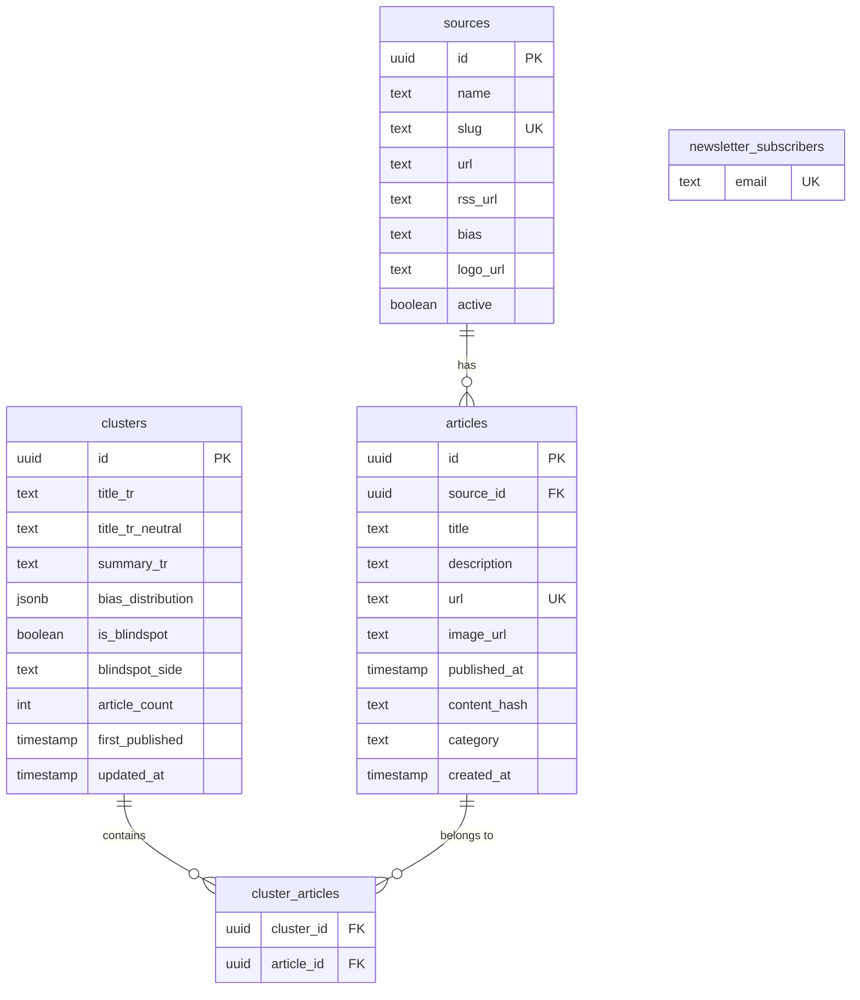

# Architecture

## System Overview

Tayf is a Next.js 16 application that aggregates Turkish news from 144 RSS sources, clusters related articles, and presents bias analysis. Ingestion and clustering run as an **event-driven worker stream** on Supabase: a `pg_cron` `ingest-drain` job pokes the `ingest` Edge Function, an `AFTER INSERT` trigger pushes work onto `pgmq` queues, and parallel `pg_cron` `cluster-drain` / `image-drain` jobs drain those queues into co-located `cluster-consumer` and `image-consumer` Edge Functions. The previous tmux-based long-running workers (`scripts/rss-worker.mjs`, `scripts/cluster-worker.mjs`, `scripts/image-worker.mjs`) are decommissioned. The only Vercel cron in the new pipeline is `/api/cron/headline`.

For the full ADR (decision matrix, alternatives considered, audit findings addressed, migration plan), see [`adr/001-worker-stream-system.md`](adr/001-worker-stream-system.md). For operator cutover steps, see [`runbook.md`](runbook.md).

```mermaid
graph TB
    subgraph "Vercel cron"
        HEADLINE_CRON[/api/cron/headline<br/>*/5 * * * */]
    end

    subgraph "Supabase pg_cron"
        PGCRON_INGEST[ingest-drain<br/>*/3 * * * *]
        PGCRON_C[cluster-drain<br/>* * * * *]
        PGCRON_I[image-drain<br/>*/5 * * * *]
    end

    subgraph "Supabase Edge Functions (Deno)"
        INGEST[ingest<br/>RSS fan-out + normalize + upsert]
        CLUSTER[cluster-consumer<br/>3-method ensemble]
        IMAGE[image-consumer<br/>og:image backfill, SSRF-safe]
    end

    subgraph "Supabase Postgres"
        ART[(articles)]
        CL[(clusters / cluster_articles)]
        QC[(pgmq: cluster_work)]
        QI[(pgmq: image_backfill)]
        WM[(worker_metrics view)]
    end

    PGCRON_INGEST -->|net.http_post| INGEST
    INGEST -->|upsert| ART
    ART -.AFTER INSERT trigger.-> QC
    ART -.AFTER INSERT image_url IS NULL.-> QI
    PGCRON_C -->|net.http_post| CLUSTER
    PGCRON_I -->|net.http_post| IMAGE
    CLUSTER -->|read+archive| QC
    CLUSTER -->|upsert| CL
    IMAGE -->|read+archive| QI
    IMAGE -->|update image_url| ART
    HEADLINE_CRON -->|fill title_tr_neutral| CL

    subgraph "Next.js 16 App"
        HOME[/ Home<br/>Ranked cluster feed]
        BLIND[/blindspots]
        DETAIL[/cluster/id]
        SRC[/sources]
        SRCPF[/source/slug]
        TL[/timeline]
        TR[/trends]
        ADMIN[/admin]
    end

    subgraph "API Routes"
        API_ADMIN[/api/admin]
        API_HEALTH[/api/health<br/>reads worker_metrics]
        API_METRICS[/api/metrics<br/>reads worker_metrics]
        API_NEWS[/api/newsletter]
    end

    CL --> HOME
    CL --> BLIND
    CL --> DETAIL
    ART --> TL
    ART --> TR
    WM --> API_HEALTH
    WM --> API_METRICS
```

## Worker stream pipeline

| Stage | Surface | Cadence | Responsibility |
|---|---|---|---|
| Ingest trigger | pg_cron `ingest-drain` → `net.http_post` | `*/3 * * * *` | Service-role-bearer-checked invocation of the `ingest` Edge Function, scheduled inside Postgres so the cron registry (`cron.job`) is the single source of truth for the worker stream's cadence |
| Ingest | Supabase Edge Function `ingest` | per invocation | Fans out across 144 RSS sources with a concurrency-bounded pool, charset-aware decode (CP1254 / iso-8859-9 + UTF-8), unified sha1-of-shingles `content_hash`, idempotent upsert into `articles` |
| Enqueue | Postgres trigger `AFTER INSERT ON articles` | per row | `pgmq.send('cluster_work', ...)` for politics articles; `pgmq.send('image_backfill', ...)` when `image_url IS NULL` |
| Cluster drain | Edge Function `cluster-consumer`, scheduled by `pg_cron` | `* * * * *` | `pgmq.read(vt=60, qty=50)` → run 3-method ensemble → upsert into `clusters` + `cluster_articles` → `pgmq.archive` on success, `pgmq.delete` on permanent failure (>3 reads) |
| Image drain | Edge Function `image-consumer`, scheduled by `pg_cron` | `*/5 * * * *` | Fetch first 50 KB of article URL, extract `og:image` / `twitter:image`, SSRF guard (RFC1918/169.254/loopback/IPv6 link-local), update `articles.image_url` |
| Headline | Vercel cron `/api/cron/headline` | `*/5 * * * *` | LLM-generated neutral Turkish title for new clusters lacking `title_tr_neutral` |
| KAP drain | Edge Function `kap-ingest`, scheduled by `pg_cron` `kap-drain` | `*/10 * * * *` | Pulls the last two Istanbul days of KAP disclosures (`POST /tr/api/disclosure/members/byCriteria`, 2000-row cap, walked one day at a time) into `kap_disclosures`; `{"companies":true}` refreshes `bist_companies` + auto `bist_aliases` from the KAP company list. `scripts/kap-backfill.mjs` walks history. Migration 049. |
| Ticker resolve | Postgres trigger `articles_resolve_tickers` (AFTER INSERT), plus hourly `pg_cron` sweep `resolve-tickers` | per row / `7 * * * *` | Matches each new article to `bist_aliases` (folded whole-word substring) and to uppercase ticker codes, writing `article_tickers` within the ingest transaction. Migration 051 (was a 10-min cron in 049). |
| Bars | Edge Function `quotes-ingest`, scheduled by `pg_cron` `quotes-daily` / `quotes-intraday` | `*/3 15-16 * * 1-5` UTC / `*/5 7-15 * * 1-5` UTC | Yahoo chart endpoint (`<CODE>.IS`). Daily: 80 stalest traded tickers per call (1y on first fill, 1mo after) into `bist_bars_daily`. Intraday: every ticker named in the news in the last 7 days, 5-minute bars into `bist_bars_5m`. `bist_quote_stats` (relative volume), `price_at()` / `feed_reference_prices()` (price at headline time) and the labelled `ml_news_events` / `ml_disclosure_events` views (r0/r1/r5/r20/pre5) read from these. Migration 051. |
| Jev shadow | Edge Function `jev-shadow`, scheduled by `pg_cron` `jev-shadow` | `*/10 * * * *` | Shadow-only: asks TypeSafe Jev 12 typed questions per run across article/cluster/pair/KAP/title-version subjects and writes `jev_shadow_*` (service_role-only, no reader ever sees it). Compares each answer to a baseline where one exists. Migration 061. |
| Jev şimdi tasks | Edge Function `jev-shadow`, same schedule as above | `*/10 * * * *` | Three new shadow tasks added to the 12 from 061: `pair_positive` (mirrors `pair_negative`, baseline "true"), `ticker_relevance` (per `article_tickers` match, up to `JEV_TICKER_LIMIT` rows/run), and `neutral_pick` (extractive-vs-Jev neutral title choice per cluster). Migration 063. |
| Jev cluster audit | Edge Function `jev-shadow` (audit mode), scheduled by `pg_cron` `jev-cluster-audit` | `55 3 * * *` | Nightly accuracy audit: pokes `jev-shadow` with `{"mode":"audit"}`, sampling up to 500 pairs each for `pair_positive` and `pair_negative` against cluster membership rather than the live stream. Migration 063. |
| Jev sinyalleri | Postgres SQL functions, scheduled by `pg_cron` `jev-signals-nightly` | `05 4 * * *` | SQL-only nightly job (no Edge Function, no HTTP): `jev_source_drift_compute()` writes per-source label drift against each source's trailing 14-day baseline into `source_drift_daily`, `jev_kap_canary_compute()` raises a `jev_alerts` row when the day's `kap_class` disagreement rate crosses 10%. Zero gateway calls. Failures surface only in `cron.job_run_details` -- no Sentry. Migration 065. |

The pgmq queues give at-least-once delivery with visibility timeouts; the `worker_metrics` view feeds `/api/health` and `/api/metrics`. Cold-start risk on the Edge Functions is mitigated by the regular pg_cron cadence keeping the instances warm.

### Jev live marginal verification (P3, migration 064)

`cluster-consumer` calls TypeSafe Jev live, not just shadow, for at most one per-article decision: when the ensemble's best candidate lands in one of two narrow score bands relative to `FALLBACK_FLOOR` (0.36) / `MATCH_THRESHOLD` (0.40):

- **band-low** `[0.36, 0.40)` — today this score never joins an existing cluster; Jev p ≥ 0.7 upgrades it to a join.
- **band-high** `[0.40, 0.44)` — today this score always joins; Jev p < 0.3 downgrades it to a reject, letting the ensemble's own fallback chain (next candidate, or `createCluster`) decide instead.

Gated by the `JEV_LIVE_PAIRS=1` Edge secret (plus a non-empty `AI_GATEWAY_API_KEY`); one gateway call per article, `AbortSignal.timeout(1500)`, hard-capped at 40 calls per drain invocation. Any error, timeout, malformed response, budget exhaustion, or failed prediction insert leaves the ensemble's decision untouched. On a band-high reject, the fallback chain may only reach a candidate the ensemble would have joined on its own (score ≥ `MATCH_THRESHOLD`); otherwise a new cluster is created — the live path can only ever narrow, never widen, the blast radius of a bad call. Pure decision logic lives in `supabase/functions/_shared/cluster/jev-verify.ts` (`classifyBand`, `decideMarginal`, `JEV_LIVE_POLICY`); the raw-fetch gateway client is `supabase/functions/_shared/jev-client.ts`. Every live decision is written as a `jev_shadow_predictions` row (`task = 'pair_marginal'`, `run_id null`), and the drain response gains a `jev_live` block:

```json
{ "jev_live": { "enabled": false, "calls": 0, "joined_by_jev": 0, "rejected_by_jev": 0, "errors": 0, "timeouts": 0, "budget_skipped": 0 } }
```

With the flag unset, `enabled` is `false` and cluster-consumer's behaviour, DB writes, and JSON output are byte-for-byte identical to before this pack. See migration `supabase/migrations/064_jev_cluster_live.sql` and `docs/migration-guide.md` for the outlier-ejection queue (P5) and blindspot recall check (P4) this same migration adds.

## Data Model



## Key Modules

### Data Layer (`src/lib/`)

| Module | Responsibility |
|---|---|
| `clusters/politics-query.ts` | Fetches, filters (≥60% politics), dedupes, wire-collapses, caps source fairness, and importance-ranks clusters for the home feed. Single PostgREST embedded select. |
| `clusters/cluster-detail-query.ts` | Fetches a single cluster with all members + full source directory. Two parallel round-trips. |
| `bias/config.ts` | Single source of truth for bias labels, colors, spectrum order, and the 10→3 zone mapping. |
| `bias/cross-spectrum.ts` | Detects "surprise" outlets covering a story dominated by the opposing zone. Guards: ≥5 sources, ≥0.65 threshold, ≥3 absolute margin. |
| `bias/analyzer.ts` | Empty-distribution factory; blindspot detection lives in `supabase/functions/_shared/cluster/blindspot.ts`. |
| `supabase/functions/_shared/rss/fetcher.ts` | Deno-side single-feed fetcher with charset-aware decoding, per-source header overrides and 15s timeout. Called from the `ingest` Edge Function via a bounded worker pool. |
| `supabase/functions/_shared/rss/normalize.ts` | Deno-side article normalization: URL canonicalization, HTML entity decoding, og:image extraction, sha1-of-shingles `content_hash` (migration 026 CHECK constraint enforces 40-char hex), keyword-based category classification, sports source force-tagging. |
| `supabase/functions/_shared/og-image.ts` | Fetches `og:image` from article pages via `_shared/safe-fetch.ts` (reads only first 50KB up to `</head>`). |
| `supabase/functions/_shared/jev.ts` | Runtime-agnostic TypeSafe Jev shadow algorithm (state builders, baselines, agree rules, budget/deadline/retry-aware `runJevShadow` orchestrator) behind the `JevPorts` seam; `jev-shadow/index.ts` binds it to the service-role client and a raw gateway fetch. Migration 061. |
| `supabase/functions/_shared/archive.ts` | Pure, runtime-agnostic nightly archive export behind the `ArchivePorts` seam. Since migration 065 each `articles.jsonl` row carries a `labels` object (`question_set`, `politics_p`, `topic`, `clickbait_p`, `framing`, `sensational`) read from `jev_shadow_predictions`, and `manifest.json` carries `labels: {source: "typesafe-ai/jev via jev-shadow", question_set, coverage, declared: true}`. These labels are MODEL-DERIVED and DECLARED as such: they are one model's answers under a pinned question set, not editorial judgements and not ground truth. `clusters.jsonl` / `articles.jsonl` rows are key-sorted recursively so they hash stably; `manifest.json` is NOT key-sorted — its literal key order is schema, day, generated_at, files, rows, bytes, labels, and changing it changes the manifest hash. `ARCHIVE_SCHEMA` deliberately stays `tayf-archive/1` -- the `labels` addition is purely additive, so `manifest.labels.declared`, NOT the schema string, is the only supported feature flag a consumer may branch on; already-exported days keep the pre-065 shape forever (`runArchiveExport` returns `skipped` when a ledger row exists), so the row shape actually changes at an arbitrary date boundary within schema `/1`. |
| `jev_gold_set` / `jev_gold_labels` | service_role-only gold sample (`jev_gold_set`) and its two-labeler correctness labels (`jev_gold_labels`), read and written by `/admin/jev-altin`. Migration 063. |
| `jev_gold_seed` / `jev_gold_next` / `jev_gold_scorecard` | `SECURITY DEFINER` RPCs — seed the gold sample, hand out the next unlabeled row per labeler, and compute the agreement scorecard read by `/admin/jev-altin`. Migration 063. |
| `sources/factuality.ts` | Hand-tagged factuality + ownership metadata for ~30 outlets. |
| `finance/queries.ts` | Read side of the finance substrate (migrations 049/050) for `/ekonomi`, `/ekonomi/[ticker]` and `/admin/ekonomi`: ticker-matched article feed, attention ranking, KAP stream, per-ticker page, health, rule-based `finance_signals`, coverage-lag histogram. All `"use cache"`, throw on error. |
| `finance/quotes.ts` | `QuoteSource` boundary with the Yahoo chart implementation (`<CODE>.IS`, 5d/1d). `getQuotes()` is the cached edge (5 min); swap `defaultQuoteSource()` for a paid feed. |
| `rate-limit.ts` | In-memory token-bucket rate limiter with periodic idle-bucket cleanup. |

### Ranking Pipeline (`politics-query.ts`)

The home feed ranking combines five signals:

```
score = W_ARTICLE_COUNT * log2(effectiveCount + 1)
      + W_ZONE_DIVERSITY * log2(distinctZones + 1)
      - W_TIME_DECAY * (ageHours / 6)
      - W_DOMINANCE_PENALTY * oneSourceDominance
      + W_VELOCITY * velocity
```

Where `effectiveCount = min(wireCollapsedCount, sourceFairnessCappedCount)`.

### Blindspot Detection (`blindspots/page.tsx`)

Clusters qualify as blindspots when:
1. ≥5 distinct sources (post same-source dedupe)
2. Dominant Medya DNA zone share ≥80%
3. ≥60% politics/breaking-news category
4. First published ≥24h ago (time-lag artifact filter)
5. ≥50% distinct content hashes (wire filter)
6. ≤50% dünya category (foreign affairs filter)
7. No SEO pattern titles (kimdir, kaç yaşında, etc.)

## Caching Strategy

Tayf uses Next.js 16 Cache Components (`"use cache"` directive) with named cache profiles:

| Profile | stale | revalidate | expire | Used by |
|---|---|---|---|---|
| `cluster-feed` | 60s | 300s | 3600s | Home feed, cluster detail, timeline, blindspots |
| `source-directory` | 60s | 300s | 3600s | Sources page, source profiles |

Cache tags (`cacheTag`) enable targeted invalidation: `clusters`, `clusters-politics`, `cluster-detail:{id}`, `sources`, `articles`.

## Security

- **CSP headers** on all routes (script/style/img/connect directives)
- **HSTS**, X-Content-Type-Options, X-Frame-Options, Referrer-Policy, Permissions-Policy
- **Rate limiting** on mutating endpoints (admin POST, newsletter, cron ingest/backfill)
- **CRON_SECRET** bearer token for cron endpoints
- **robots.txt** disallows `/admin` and `/api/`
- Wildcard `images.remotePatterns` — acceptable because image URLs enter only through the Deno-side `_shared/rss/normalize.ts` + `_shared/og-image.ts` pipeline, both gated by the `_shared/safe-fetch.ts` SSRF allowlist (DNS-resolves the host and rejects RFC1918, loopback, link-local, ULA, CGNAT, IPv6 documentation prefixes); never from user input

## External Dependencies

| Dependency | Purpose |
|---|---|
| Supabase | PostgreSQL database + PostgREST API + pgmq queues + Edge Functions (Deno) |
| `rss-parser` | RSS/Atom feed parsing |
| `@sentry/nextjs` | Error tracking on the Next.js side; client + server + edge runtimes |
| `@base-ui/react` | Headless UI primitives (Dialog, Select, Button, etc.) |
| `class-variance-authority` | Component variant management |
| `tailwind-merge` + `clsx` | Class name composition |
| `lucide-react` | Icon library |
| Google Fonts | DM Serif Display, Plus Jakarta Sans, JetBrains Mono |
